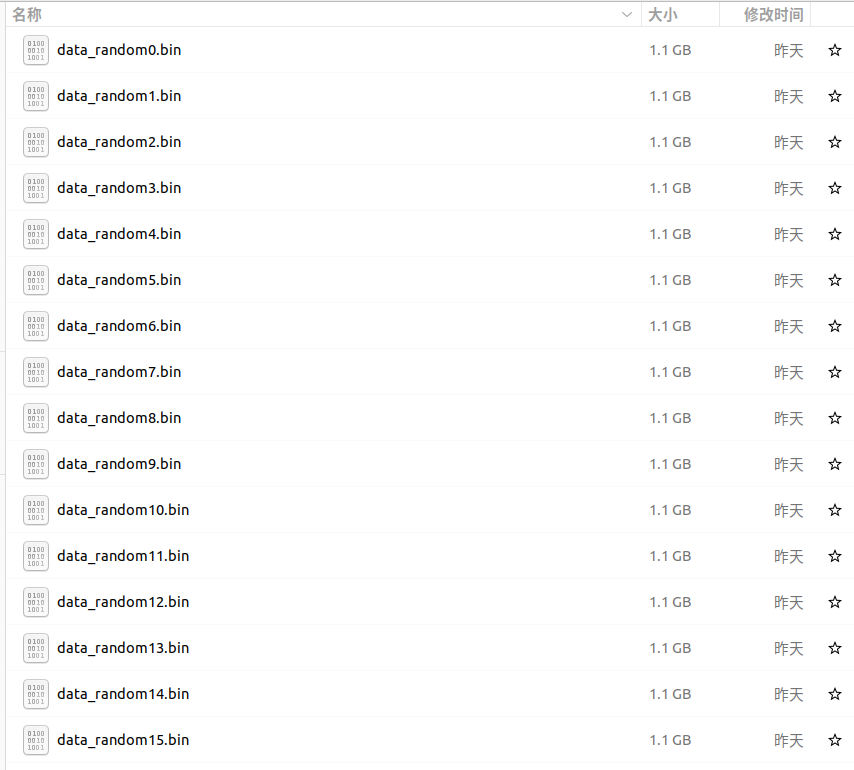
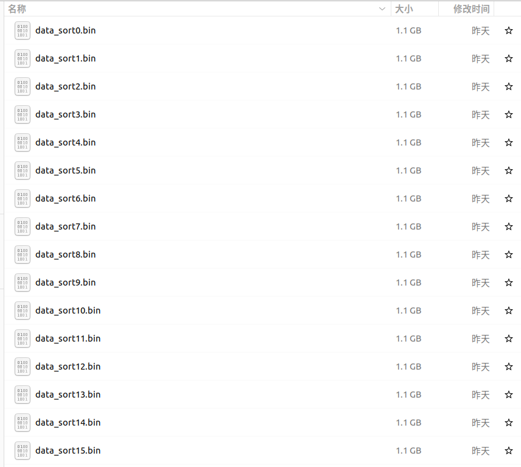
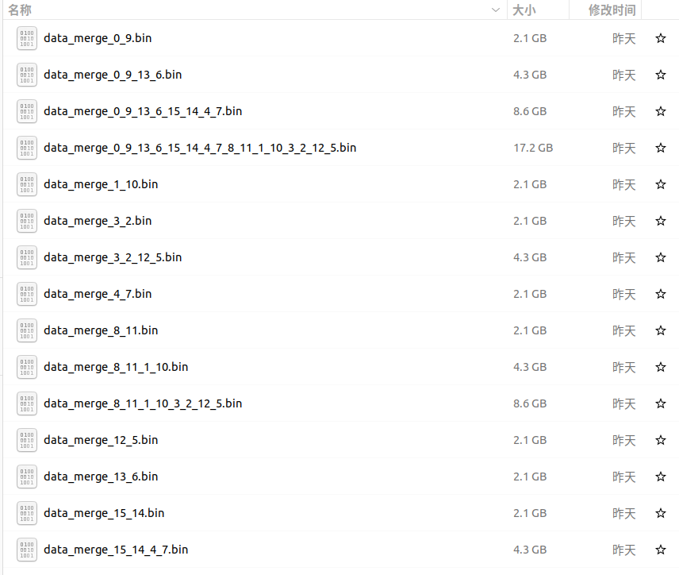
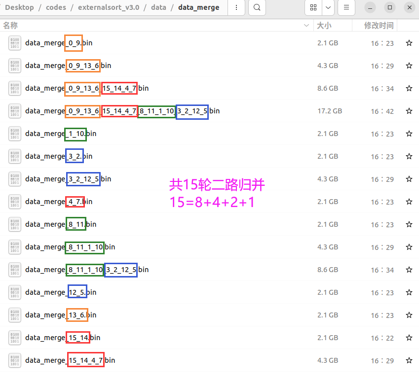
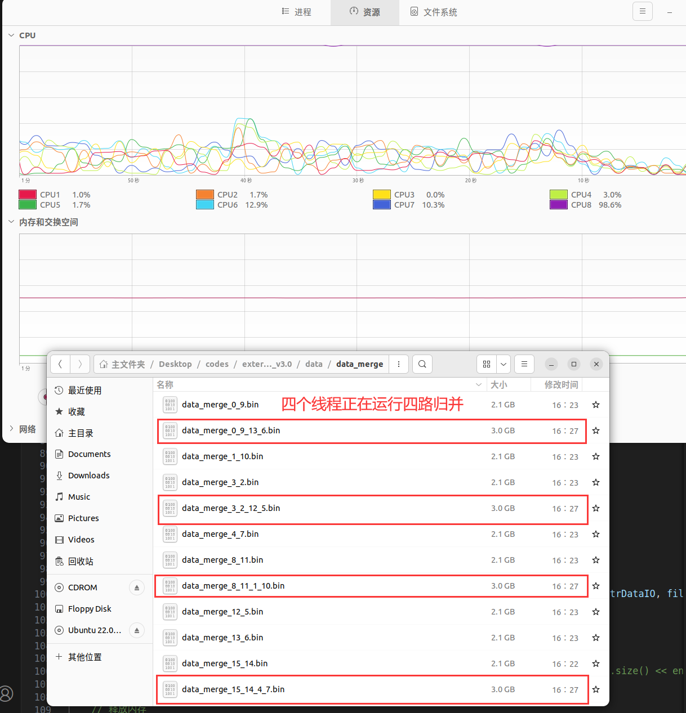
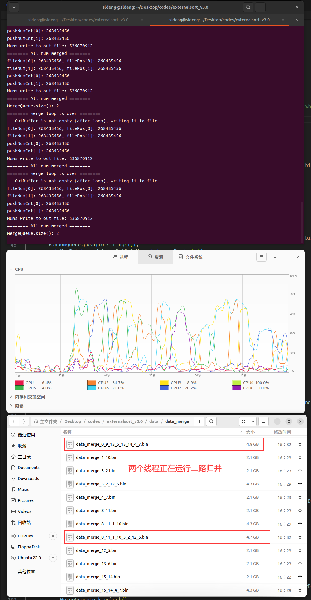
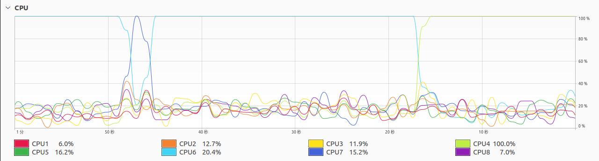

# Multi-Thread External Sort for Big Data under Small Memory 
V3.0版本，此版本正式实现多线程-小内存-大量外部数据-并行排序与归并。

Codes (ranged from v0.2 to v3.0) are avaiable at [github](https://github.com/slDeng1003/Multi_Thread_External_Sort).

**run with:**

> cd ./Multi_Thread_External_Sort_v3.0
>
> g++ -o MultiThreadExtSortTest DataIO.h NumberControler.h ThreadPool.h KShotMergeMinHeap.h DataIO.cpp KShotMergeMinHeap.cpp MultiThreadExtSortTester.cpp
>
> ./MultiThreadExtSortTest

**Environment:**

Ubuntu 22.04.3, g++ 11.4.0, gcc 11.4.0

## Problem
多线程-小内存-大量外部数据-并行排序与归并。

外部数据：16GB

单线程最大可用内存（排序）：2MB

单线程最大可用内存（K路归并）：(K+4)MB。`K`为归并文件数，1MB为每个文件输入缓冲区大小，4MB为输出缓冲区大小。

最大线程：16

## Advantages

本方案经过多次迭代，最终版本（v3.0）在解决问题的前提下，实现了多线程下高并发。此外，还额外考虑到通用性和扩展性，以及内存管理。历代版本见github仓库中commit记录，每个版本都是可运行的代码，且附有详细注释。

**1、通用性高。**

本方案支持**任意**数量和大小外部文件、**任意**大小排序内存、**任意**大小归并（输入缓冲区和输出缓冲区）内存、每次可归并**任意**数量文件。

**2、性能高。**

排序算法使用快速排序，时间复杂度为O(NlogN)。

归并算法使用K路最小堆归并，每个随机数仅访问一遍，时间复杂度为`O(2*N*logK)`，其中K为较小的数字（一般设定为8，实际多线程测试中，K=2）。具体来说，每次循环都从最小堆弹出1个数到输出缓冲区，然后向最小堆插入1个数。最小堆插入操作（push()）时间复杂度为`O(logK)`，最小堆弹出操作时间复杂度为`O(logK)`。每个数仅在插入最小堆时访问，没有多余的遍历操作。每个数运行一次插入和弹出，则总时间复杂度为`O(N*logK)+O(N*logK)=O(2*N*logK)`。

最坏情况下（排序与归并串行），时间复杂度为`O(NlogN)+O(NlogK)，K<<N`。多线程情景下，排序算法与归并算法并行，实际上时间复杂度接近**`O(NlogN)`**。

**3、扩展性高。**

支持**任意**数量随机文件排序，只需获得随机文件名，程序可自动获取排序文件名和待归并文件名，无需用户手动指定。程序生成的随机文件也可以由用户指定文件数和文件大小。

**4、内存管理严格**

所有内存显式声明、释放。所有文件显式打开、关闭。所有指针在结束寿命后挂空。


## Solution

### `NumControler.h`

以全局变量形式定义关键参数。

例如：随机数文件个数、随机数文件大小、排序内存大小、归并输入缓冲区大小、归并输出缓冲区大小。

若要运行本程序，建议先选择`NumControler.h`中的"small file"对应参数运行，以节省时间。

### `DataIO.h` and `DataIO.cpp`

`DataIO.h`定义数据IO操作，`DataIO.cpp`实现。

包括：

1、生成未排序的随机数据，将数据分为fileNum个相同大小的文件存储到磁盘

2、单个线程排序，将排序结果写入新文件。排序算法调用`<algorithm>`库中的`std::sort()`。

3、将排序结果分块输出，每块的前几个结果输出

4、获取文件中`int_64t`数字的数量

5、将未排序文件读入内存

6、将排序后数据写入文件

7、读文件到输入缓冲区

8、出缓冲区数据写入文件

9、哈希函数，用于生成随机数

具体声明如下：

```c++
class DataIO {
public:  
    // 生成未排序的随机数据，将数据分为fileNum个相同大小的文件存储到磁盘
    void RandNumFileGenerate(int64_t * mem, FILE **fPtrUnsort);
    // 适用于单个线程，每次给单个文件排序，将排序结果写入新文件
    static void RandDataFileSort(string fileIdxRandom, queue<string>* SortQueue, mutex* SortQueueLock);
    // 将文件分为fileBlock个内存块输出，每个内存块的前numsPrint个结果输出
    void FileNumPrint(int64_t*mem, string filename, unsigned short fileBlock, unsigned short numsPrint);
    // 获取文件中int_64t数字的数量
    static int64_t GetFileNums(string filename);
    // 将未排序文件读入内存
    static int64_t ReadUnsortData(int64_t* SortMem, FILE * fPtrRandom, int64_t filePos, int64_t fileNums);
    // 将排序后数据写入文件
    static int64_t WriteSortData(int64_t* SortMem, FILE * fPtrSort, int64_t numToWrite);
    // 读文件到输入缓冲区
    int64_t ReadUnmergeData(int64_t* MergeMemInBufSingle, FILE * fPtrMergeSingle, int64_t filePos, int64_t fileNums);
    // 输出缓冲区数据写入文件
    int64_t WriteMergeData(int64_t* MergeMemOutbuf, FILE * fPtrOut, int64_t OutbufPos);

private:
    // 哈希函数，用于生成随机数
    int64_t HashFunc(int64_t X);
};
```


### `KShotMergeMinHeap.h` and `KShotMergeMinHeap.cpp`

单线程K路最小堆归并。`KShotMergeMinHeap.h`定义，`KShotMergeMinHeap.cpp`实现。

**核心技术：**

1、维护一个大小为`K`的最小堆，同时对`K`个外部文件执行`K`路归并。

2、调用`<queue>`库中的`priority_queue`实现最小堆`MinHeap`。

最小堆的元素类型为`struct`，用于存储数字及数字对应输入缓冲区的序号。

3、每个外部文件读取一小部分数据到输入缓冲区`MergeMemInbuf`，最小堆的堆顶数字输出到输出缓冲区`MergeMemOutbuf`。

输入缓冲区空才从文件中继续读取，输出缓冲区满才写入输出文件。

输入缓冲区和输出缓冲区大小为MB级别，外部文件大小为GB级别。

4、严格的内存管理。归并所需内存在归并函数内申请与释放，归并涉及文件在归并函数内打开与关闭。内存释放、文件关闭后，指针置空。

声明如下：

```c++
class KShotMergeMinHeap {
public:
    // K路归并排序
    static void KShotMerge(DataIO *dataio, vector<string> fileIdxSortVec, vector<string> fileIdxMergeVec, queue<string> *MergeQueue, mutex *MergeQueueLock, int64_t fileNumTotal, bool *stopflag, mutex *stopflagLock);

private:
    // 判断是否K个文件中所有数字已经插入最小堆
    static bool IsAllFileIntoHeap(unsigned short K, int64_t *fileNum, int64_t * headNumCnt);

};
```


### `ThreadPool.h`

线程池，用于实现多线程排序与多线程归并。线程池只是一个线程管理工具，排序程序、归并程序、队列和互斥量实现线程同步与互斥才是核心思想。

为避免重复造轮子，使用github上[lzpong](//https://github.com/lzpong/)实现的线程池。


### `MultiThreadExtSortTester.cpp`

主函数，调用上述各文件，实现**多线程-小内存-大量外部数据-并行排序与归并**功能。

**要求：**排序与归并并行，而且能在N个文件（V>>K）的情景下串行。

**核心思路：**用一个队列`RandomQueue`存储随机文件（待排序）；两个队列`SortQueue`和` MergeQueue`分别存储刚排序完成的文件（很可能还需要再次归并）与多次归并文件（可能还需要再归并，也可能结束归并）。

`RandomQueue`队列存储随机文件，`SortQueue`队列存储刚排序完成的文件，` MergeQueue`存储经过至少一次归并（但可能还需要再次归并）的文件。

随机文件插入`RandomQueue`队列等待排序，排序程序检测`RandomQueue`队列，取文件进行排序，排序后插入`SortQueue`队列等待归并。

主程序检测`SortQueue`队列和`MergeQueue`队列，取文件进行归并，归并后重新插入`MergeQueue`队列等待（可能存在的）再次归并。

**核心问题：**`MergeQueue`队列是一个循环队列，如何判断何时归并已经结束？即，终止条件是什么？

如果采用时钟终止条件，一段时间内没有新文件入队则终止，可能存在误判的问题，且时钟大小本身也是一个对外部文件大小、硬件条件敏感的超参数。 

如果某一次归并时，某个线程所处理的int64型数字量恰好等于总的随机数个数（也等于排序后的数字个数），则代表所有随机数（排序数）都被归并。反过来说，如果不等于，则代表还有一定数量的随机数等待归并。因此，仅需判断数字量是否相等即可。

**核心算法如下：**

注：

1、`RandomQueue`存储随机文件序号，如存储string"0"代表"./data/data_random/data_random0.bin"；
2、`SortQueue`存储排序文件序号，如存储string"0"代表"./data/data_sort/data_sort0.bin"；
3、`MergeQueue`存储归并文件序号，如存储string"0_1_2_3"代表对排序文件{0,1,2,3}执行归并，然后生成文件./data/data_merge/data_merge0_1_2_3.bin"；
4、处理RandomQueue,SortQueue和MergeQueue需要加互斥锁。`RandomQueueLock`，`SortQueueLock`， `MergeQueueLock`对应排序队列互斥锁。
5、`stopflag`传地址给归并函数，若归并函数单次归并数字总量等于随机数总量，则令其为1（加互斥锁操作）。

```c++
while (!stopflag) {
    if (RandomQueue.size()>0) {
        RandomQueueLock.lock();
        RandomQueue.front();
        RandomQueue.pop();
        提交给线程池排序，排序后文件名由线程push入SortQueue;
        RandomQueueLock.unlock();
    }
    if (SortQueue.size()>1) {
        SortQueueLock.lock();
        for (最多K次) {
            SortQueue.front();
            fileIdxSortVec.push_back();
            SortQueue.pop();
        }
        提交给线程池归并，归并后文件名由线程push入MergeQueue;
        SortQueueLock.unlock();
        若归并数字量等于所以文件中随机数总量，则stopflag=1（加互斥锁）;
    }
    if (mergeQueue.size()>1) {
        MergeQueueLock.lock();
        for (最多K次) {
            MergeQueue.front();
            fileIdxMergeVec.push_back();
            MergeQueue.pop();
        }
        提交给线程池归并，归并后文件名由线程push入MergeQueue;
        MergeQueueLock.unlock();
        若归并数字量等于所以文件中随机数总量，则归并线程置stopflag=1（加互斥锁）;
    }
}
```


## Result

### 结果摘要

对于16个1GB的`int_64`随机数文件，线程池最大线程数为16，归并最大路数`maxK`为8。

共运行16次排序，15次2路归并（8+4+2+1=15）。若线程池最大线程数显著小于文件数，程序运行过程中会看到`0~maxK`路归并。

实测中CPU稳定多核运行，内存占用约50MB，磁盘读取约86GB，磁盘写入约103GB，磁盘写入速度稳定值50MB/s，峰值10GB/s。

### 详细结果

#### 1、程序完整输出结果附件

​	附件`v3.0小内存**小数据**多线程并行排序归并输出结果.txt`记录了程序在**16\*8MB测试数据**上运行过程中的全部输出，并且抽样输出了排序后文件中的数字和归并结果文件中的数字。具体来说，有16个8MB的随机数文件；单个线程排序内存为2MB；单个线程归并内存为(K*1+4)MB，即K个大小为1MB的输入缓冲区，1个大小为4MB的输出缓冲区。

​	附件`v3.0小内存**大数据**多线程并行排序归并输出结果.txt`记录了程序在**16\*1GB测试数据**上运行过程中的全部输出，并且抽样输出了排序后文件中的数字和归并结果文件中的数字。具体来说，有16个1GB的随机数文件；单个线程排序内存为2MB；单个线程归并内存为(K*1+4)MB，即K个大小为1MB的输入缓冲区，1个大小为4MB的输出缓冲区。

#### 2、数据分析

Ubuntu系统中1K=1000，而不是1024，故1GB=1073741824 B显示为1.1GB，实际上字节数相等，如图所示。


共有16个1GB的随机数文件如图所示。





共有16个1GB的排序后随机数文件如图所示。




共有4轮归并，每轮处理的文件数分别为{8,4,2,1}，如图所示。





#### 3、归并结果分析

​	本轮测试中，共进行了15次二路归并。按文件划分，可划分为四轮归并，每轮归并文件数分别为{8,4,2,1}。每一轮归并所合并的文件序号被保存到文件名中，例如，随机文件`data_random0.bin`和随机文件`data_random9.bin`，排序后的文件分别为`data_sort0”和”data_sort9` ，这两个排序文件经过归并后合并为文件`data_merge_0_9.bin` （对应图中橙色）。

- **第1轮归并：**两个排序文件的归并，例如文件`data_sort0.bin`和文件`data_sort9.bin`，归并为`data_merge_0_9.bin` （对应图中橙色）。
- **第2轮归并：**两个经过第1轮归并文件的归并，例如文件`data_merge_0_9.bin` （对应图中橙色）和文件`data_merge_13_6.bin` （对应图中橙色），归并为`data_merge_0_9_13_6.bin`。
- **第3轮归并：**两个经过第2轮归并文件的归并，例如文件`data_merge_0_9_13_6.bin` （对应图中橙色）和文件`data_merge_15_14_4_7.bin` （对应图中红色），归并为`data_merge_0_9_13_6_15_14_4_7.bin`。
- **第4轮归并（最后一次归并）：**两个经过第3轮归并文件的归并，例如文件`data_merge_0_9_13_6_15_14_4_7.bin` （对应图中橙色+红色）和文件`data_merge_8_11_1_10_3_2_12_5.bin` （对应图中绿色+蓝色），归并为`data_merge_0_9_13_6_15_14_4_7_8_11_1_10_3_2_12_5.bin` （对应图中橙色+红色+绿色+蓝色）。



#### 4、第二轮归并

​	第2轮归并是两个经过第1轮归并文件的归并，例如文件`data_merge_0_9.bin` （对应图中橙色）和文件`data_merge_13_6.bin”`（对应图中橙色），归并为`data_merge_0_9_13_6.bin`。

​	下图展示了第2轮归并运行时的资源情况和文件情况。

- CPU资源监控表明：程序正在多线程执行，事实上，每个归并线程处理两个文件，其处理的文件又是第1轮二路归并的结果。
- 内存资源监控表明：内存占用曲线和平行于X坐标轴，说明程序运行过程中内存管理到位，没有产生额外的内存开销，且第1轮归并的线程申请的内存空间被释放（若未释放，会产生内存增长）。
- 归并输出文件：第2轮归并的输出文件见图中红框。文件大小为3.0GB，是因为归并线程正在运行，一边归并一边写入，还未归并结束。根据上文中图7所示，第2轮归并后结果文件为4.3GB。



#### 5、第三轮归并

​	第3轮归并是两个经过第2轮归并文件的归并，例如文件`data_merge_0_9_13_6.bin`和文件` data_merge_15_14_4_7.bin`，被归并为`data_merge_0_9_13_6_15_14_4_7.bin`。下图展示了第3轮归并时资源情况和命令行窗口输出信息（完整信息见附件`v3.0小内存大数据多线程并行排序归并输出结果.txt`）。同理，归并程序多线程执行，且内存未增长。



#### 6、第四轮归并

​	第4轮归并，同时也是最后一次归并，是对两个第3轮归并结果文件的再次归并，例如文件`data_merge_0_9_13_6_15_14_4_7.bin` （对应上文图中橙色+红色）和文件` data_merge_8_11_1_10_3_2_12_5.bin`（对应上文图中绿色+蓝色），归并为`data_merge_0_9_13_6_15_14_4_7_8_11_1_10_3_2_12_5.bin` （对应上文图中橙色+红色+绿色+蓝色）。
​	下图展示了第4轮归并时资源占用情况。同理，归并程序多线程执行，且内存未增长。



​	下图展示了第4轮归并运行时线程占用资源统计。由图12可见，进程占用内存量不大（51.0MB），说明程序满足小内存要求。磁盘读取和写入速度较高，说明是从内存（输出缓冲区）写入磁盘（文件），而不是从CPU写入磁盘（CPU->磁盘速度很慢）。


#### 7、程序（进程）接近结束时，资源统计

下图展示了程序（进程）接近结束（所有完成的排序线程和归并线程已经被释放，第4轮归并接近结束）时的进程资源统计。

下图所示，进程名为”MultiThreadExtSortTest”，即编译时生成的可执行文件名称，进程ID为7873。此时进程对CPU的占用率为16.80%，占用内存54.9MB（小于64MB），总计从磁盘读取85.5GB数据，总计写入102.9GB数据（随机文件17.2GB+排序文件17.GB+归并文件68.7GB=103.1GB）。磁盘写入速度为17.3MB/s，也侧面说明是从内存（输出缓冲区）写入磁盘（文件），而不是从CPU写入磁盘（CPU->磁盘速度很慢）。


事实上，程序运行过程中，磁盘读取和写入速度一度可以达到GB/s级别，如下图所示。


#### 8、程序结束后数据量统计

下图展示了程序运行结束后的总数据量为103.1GB，结合上文内容，可知16个随机文件总大小为17.2GB。16个排序文件总大小为17.2GB，15个归并文件总大小为68.7GB，17.2GB+17.2GB+68.7GB=103.1GB。


